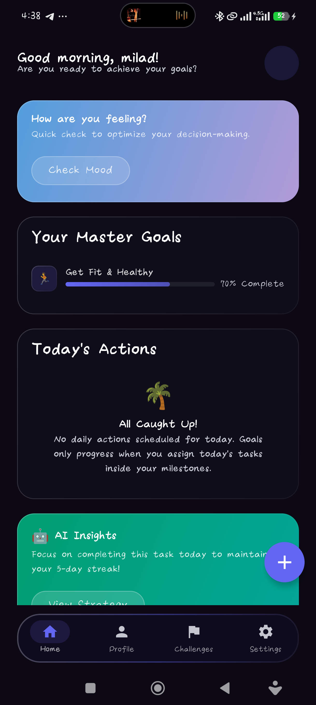
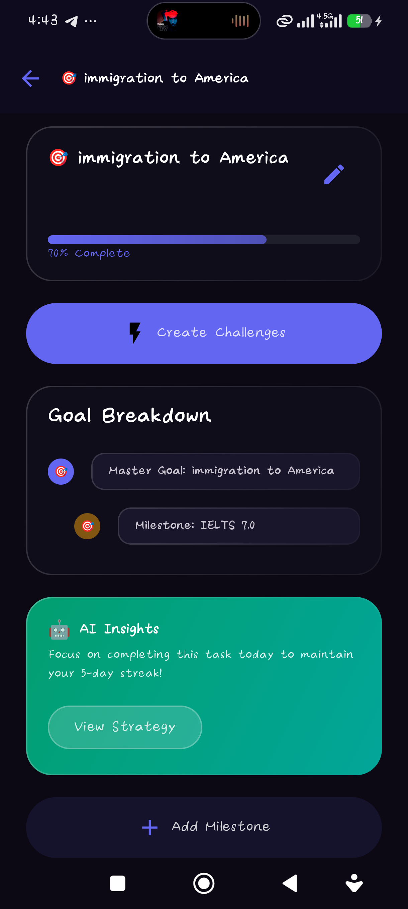

# 🎯 Way2Target

[](https://kotlinlang.org/docs/multiplatform.html)
[](https://www.jetbrains.com/lp/compose-multiplatform/)
[](https://github.com/arkivanov/MVIKotlin)
[](https://github.com/arkivanov/Decompose)

**Way2Target** is a premium, cross-platform self-growth lifestyle application designed to empower individuals to define personal goals, track milestones, and conquer life's blockers with confidence using AI-driven strategies.

---

## 📱 App Previews

<p align="center">
  
  &nbsp;&nbsp;&nbsp;&nbsp;
  
</p>

---

## ✨ Features

*   🎯 **Strategic Goal Setting** – Define your long-term vision with custom master goals.
*   🏁 **Roadmap Breakdown** – Fragment goals into clear, actionable milestones.
*   ⚡ **Daily Actions** – Small, bite-sized tasks integrated directly into your routine.
*   🧠 **AI Appraisal & Insights** – Conversational AI analysis to keep your habits optimized.
*   🛡️ **Smart Challenge System** – Map out bottlenecks and get strategies to overcome hurdles.
*   🎨 **Dynamic Dark & Light Mode** – Beautiful, premium glassmorphism interface.
*   🌐 **Dynamic Localization** – Complete, system-wide support for English and Farsi (RTL & LTR).

---

## 🏗️ Architecture

Way2Target is built on a **Modular Clean Architecture** design ensuring absolute separation of concerns, scalability, and performance.

```text
├── composeApp/          # Main Android & iOS application shell
├── core/               # Shared utilities, extensions, and core libraries
├── domain/             # Business models, repositories, and use cases
├── data/               # Local database (SQLDelight) and API storage implementations
├── di/                 # Dependency Injection setup (Koin)
├── sharedUI/           # UI catalog, design system, theme tokens, and localizations
└── *FT/                # Self-contained feature modules (e.g. SHomeFT, SChallengeFT, etc.)
```

*   **MVI (Model-View-Intent)** – Unidirectional data flow via MVIKotlin.
*   **Decompose** – Lifecycle-aware routing and component navigation hierarchy.
*   **Koin** – Light, modular dependency injection.

---

## 🛠️ Tech Stack

*   **Language:** [Kotlin](https://kotlinlang.org/) (Multiplatform)
*   **UI:** [Compose Multiplatform](https://www.jetbrains.com/lp/compose-multiplatform/) (Jetpack Compose)
*   **Navigation:** [Decompose](https://github.com/arkivanov/Decompose)
*   **DI:** [Koin](https://insert-koin.io/)
*   **DB:** [SQLDelight](https://cashapp.github.io/sqldelight/)
*   **Async:** [Kotlin Coroutines & Flow](https://kotlinlang.org/docs/coroutines-overview.html)

---

## 🚀 Getting Started

### Prerequisites

*   **Android Studio Ladybug (or newer)**
*   **Xcode 15+** (for building/running on iOS)
*   **Kotlin Multiplatform plugin** installed in your IDE

### Setup

1.  **Clone the repository**:
    ```bash
    git clone https://github.com/vampyreLord/Way2Target.git
    ```
2.  **Open in Android Studio**:
    Open the root project directory and let the Gradle sync finish.
3.  **Run the app**:
    -   Select `composeApp` to run on Android.
    -   Use `iosApp` run configuration or Xcode to run on iOS.
